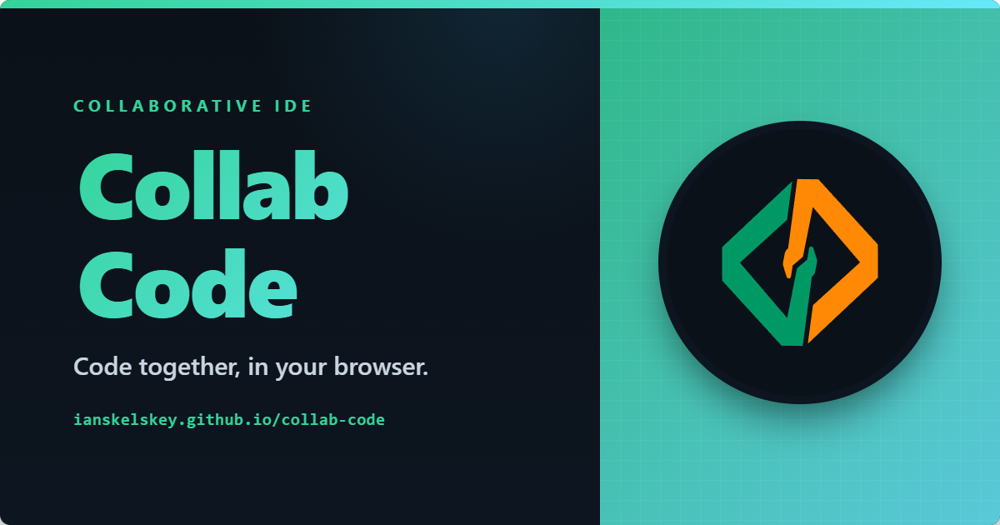

# Collab Code

Collaborative coding rooms for classrooms, tutoring sessions, and pair programming.


[](https://ianskelskey.github.io/collab-code)
[](./CONTRIBUTING.md)

Share a room link, edit the same workspace in Monaco, use one shared terminal session, manage files together, and run Java or Python from the browser through a lightweight relay server.

## Why Collab Code

Collab Code is built for the "open a link and start coding" workflow. It is meant to feel more like a shared coding room than a demo editor: multiple files, a real explorer, a shared terminal, search, diagnostics, and live collaboration all sit in the same browser-first workspace.

It is especially suited to tutoring, CS education, pair programming, and collaborative walkthroughs where setup friction gets in the way.

## Highlights

| Collaboration                                                                  | Workspace                                                                                  | Execution                                                                     |
| ------------------------------------------------------------------------------ | ------------------------------------------------------------------------------------------ | ----------------------------------------------------------------------------- |
| Live cursors, selections, peer presence, room sharing, shared terminal session | Multi-file explorer, tabs, search/replace, drag-and-drop import, multi-select file actions | Interactive Java and Python run flow, inline diagnostics, shared terminal I/O |

- **Collaborative editor** - Monaco + Yjs with live remote cursors, selections, and per-file awareness.
- **Collaborative terminal** - peers share the same terminal transcript, prompt state, working directory, and run session.
- **Real workspace** - folders, tabs, file icons, context menus, workspace search, export, and drag-and-drop file management.
- **Integrated terminal tools** - browse and modify the virtual filesystem without leaving the app.
- **Classroom-friendly sharing** - create or join a room instantly with no account flow.
- **Offline-friendly persistence** - IndexedDB keeps local workspace state around between reconnects.
- **Responsive UI** - explorer, search, editor, and terminal all adapt across desktop and smaller screens.

## Current Scope

- **Runnable languages today:** Java and Python
- **Editor/file support:** Java, TypeScript, JavaScript, Python, JSON, HTML, CSS, Markdown, C, C++, XML, and SQL
- **Best fit:** classrooms, tutoring sessions, collaborative exercises, code reviews, and quick pair-programming rooms

## Quick Start

### Try it live

Open the deployed app:

https://ianskelskey.github.io/collab-code

### Run it locally

```bash
npm install
npm run dev:all
```

Then open:

`http://localhost:5173/collab-code/`

For local development details, environment variables, architecture notes, deployment, and contributor workflow, see [CONTRIBUTING.md](./CONTRIBUTING.md).

## Execution Safety

Browser-triggered Java and Python execution runs arbitrary user code on the relay host, so deployment defaults matter.

- The Docker image is configured to require sandboxed execution and drops Java/Python child processes to a dedicated low-privilege OS user.
- Python execution now runs inside a fresh per-run virtual environment. If the workspace includes a `requirements.txt` next to the entry file or in one of its parent folders, those packages are installed into that isolated environment instead of the server's global Python installation.
- If the server is started as `root` without `EXEC_SANDBOX_UID` and `EXEC_SANDBOX_GID`, execution is now disabled by default. You can explicitly override that with `EXEC_ALLOW_UNSANDBOXED_ROOT=1`, but that is not recommended.
- Local development on platforms without POSIX `uid`/`gid` privilege dropping can still run unsandboxed unless you require sandboxing with `EXEC_REQUIRE_SANDBOX=1`.
- The app's Help -> About tab and the server health endpoint report whether execution is `Sandboxed`, `Unsandboxed`, or `Disabled`.

This is a hardening step, not a full container-per-run sandbox. If you expose execution to untrusted users, isolate the relay further at the deployment level as well.

## What You Can Do

- Create or join a room from the landing page in a few seconds.
- Edit the same workspace with other people in real time.
- Share one terminal session with other peers, including `cd`, command history, terminal output, and interactive Java/Python stdin/stdout/stderr.
- Search and replace across the entire workspace.
- Manage files with the explorer, drag-and-drop, multi-select actions, and the built-in terminal.
- Compile and run Java projects, or execute Python scripts inside an isolated virtual environment with streamed stdin, stdout, and stderr in the shared terminal.
- Export a file or the whole workspace when you are done.

## Built With

React, Vite, Monaco Editor, Yjs, xterm.js, and a small Node/WebSocket relay server.

## Contributing

Bug reports, feature ideas, and pull requests are welcome. Start with [CONTRIBUTING.md](./CONTRIBUTING.md).

## License

Released under the [MIT License](./LICENSE). You're free to use, modify, and redistribute Collab Code, including commercially, as long as the license and copyright notice are preserved.
